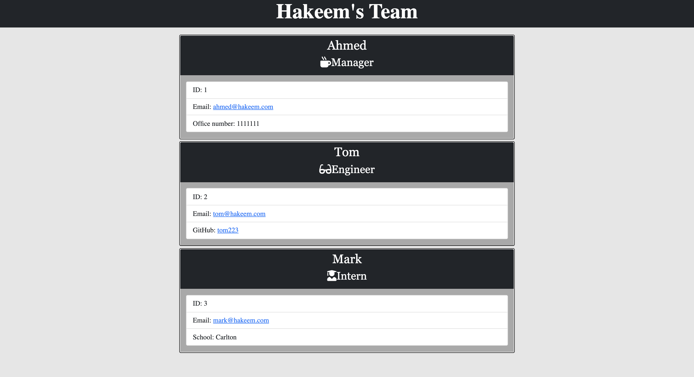

# Team Profile Generator

## Description
One of the most important aspects of programming is writing code that is readable, reliable, and maintainable. Object-Oriented Programming is the key that enable our code to meet those targets through applying the four pillars concepts.i.e Encapsulation, Abstraction, Inheritance and Polymorphism. So based on this scenario i build a Node CLI application that takes in information about employees and generates an HTML webpage that displays summaries for each person. In addition to this a unit testing also included to make the code maintanable.

## Installation
     
              1 Clone the project repository to your local machine
              2 Install npm module 
              3 Run node app.js in your Terminal
              4 Follow the promt instruction in the terminal screen
              5 The program will generate an HTML with your provided information

## Usage

[Videolink](https://youtu.be/gqa-p1hLwmM)

## Tests
The unit test is included in the application for all classes listed in the lib directory and in the test directory you can look the respective testing code for each classes. The jest library is used for testing the app and we need to create dependencies of it in package json file.You can run the tests using the following command line from your terminal.
        
              npm run test